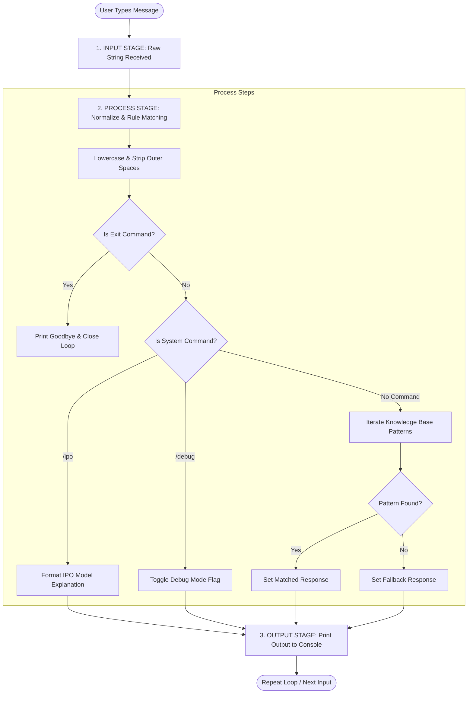

# Deterministic Rule-Based AI Chatbot

A simple yet highly structured Python command-line application that demonstrates the fundamentals of **Rule-Based Decision Logic** and the **Input → Process → Output (IPO) Model** in software engineering and AI systems.

This project was built to satisfy key learning objectives in basic artificial intelligence, input normalization, python control structures, and environment-driven configurations.

---

## 📋 Table of Contents
1. [Learning Objectives Met](#-learning-objectives-met)
2. [The Input-Process-Output (IPO) Model](#-the-input-process-output-ipo-model)
3. [Rule-Based (Deterministic) Logic vs. Machine Learning](#-rule-based-deterministic-logic-vs-machine-learning)
4. [Environment Configuration (.env)](#-environment-configuration-env)
5. [File Structure](#-file-structure)
6. [Getting Started & Installation](#-getting-started--installation)
7. [How to Use the Chatbot](#-how-to-use-the-chatbot)
8. [Sample Conversations](#-sample-conversations)

---

## 🎯 Learning Objectives Met

*   **Predefined User Queries**: Utilizes a robust knowledge base dictionary mapping intent categories to trigger patterns and responses.
*   **Deterministic AI Decision-Making**: Relies on structured rule-based routing (`if-elif-else` control blocks and keyword searching) rather than probabilistic matching.
*   **Greetings, Questions, and Exit Commands**: Gracefully handles standard greetings (e.g., hello, hi, hey), common questions (e.g., name, weather, status), and termination triggers (e.g., exit, quit, bye).
*   **Input Normalization**: Cleans and normalizes all incoming user input (lowercasing, trimming leading/trailing white space) before executing decision matching.
*   **Continuous Loop Execution**: Keeps the chatbot running indefinitely using a Python `while` loop until an explicit exit command is encountered.
*   **Zero-Dependency Environment Loading**: Reads and applies variables from a `.env` configuration file, utilizing a built-in fallback parser if external libraries are missing.

---

## 🔄 The Input-Process-Output (IPO) Model

The IPO model represents the core architecture of most computer programs and basic AI systems:

1.  **INPUT**: The system receives raw data from the outside world. In this chatbot, the input is the string entered by the user via the command-line console (`input("You: ")`).
2.  **PROCESS**: The system processes the input by normalizing it and checking it against deterministic logical patterns.
3.  **OUTPUT**: The system delivers the processed results back to the user (`print(...)`).

Here is a visual flowchart of the chatbot's IPO cycle:



---

## 🧠 Rule-Based (Deterministic) Logic vs. Machine Learning

Unlike modern Large Language Models (LLMs) which are probabilistic and generate responses word-by-word based on statistical patterns, this chatbot uses **deterministic logic**:

*   **Deterministic Logic**: Given a specific input, the system will *always* produce the exact same output. The decision paths are written in advance as fixed mapping tables (rules).
*   **Benefits**: Simple to implement, computationally lightweight, 100% predictable, and easy to test.
*   **Limitations**: Cannot handle typos, lacks understanding of context/synonyms outside the predefined patterns, and cannot generate new, creative answers.

---

## ⚙️ Environment Configuration (.env)

The chatbot loads its settings from the `.env` file at startup. This enables configuring the bot without editing the source code directly:

| Variable | Description | Default Value |
| :--- | :--- | :--- |
| `BOT_NAME` | The name the chatbot uses to identify itself. | `RuleBot` |
| `DEFAULT_GREETING` | The greeting printed when the chatbot starts up. | `Hello! I am RuleBot...` |
| `DEBUG_MODE` | Toggles detailed visual logs of the IPO model stages (`True` or `False`). | `True` |

### Example `.env` contents:
```env
BOT_NAME=RuleBot
DEFAULT_GREETING=Hello! I am RuleBot, a deterministic rule-based AI chatbot. How can I help you today?
DEBUG_MODE=True
```

---

## 📁 File Structure

```text
Project/
│
├── app.py          # Main application file containing the chatbot logic and loop
├── .env            # Environment configuration settings (bot name, greeting, debug)
└── README.md       # Comprehensive documentation for the project
```

---

## 🚀 Getting Started & Installation

### Prerequisites
*   Python 3.x installed on your computer.

### Step 1: Extract or Clone the Project
Make sure all files (`app.py`, `.env`, and `README.md`) are placed in the same folder.

### Step 2: Open a Terminal or Command Prompt
Navigate to the directory containing the project:
```powershell
cd "c:\Users\hp\OneDrive\Desktop\Internship\Project !"
```

### Step 3: Run the Application
Start the chatbot by executing:
```powershell
python app.py
```

---

## 💬 How to Use the Chatbot

Once the program runs, you can interact with it using text commands:
1.  **Type standard messages**: Ask things like `"What is your name?"`, `"How are you?"`, or `"What is the weather?"`.
2.  **Test input normalization**: Add extra spaces or mixed capitalization, e.g. `"  hElLo   "`. The bot will still recognize it!
3.  **View the IPO model breakdown**: Type `/ipo` inside the chatbot chat to print a detailed explanation of the IPO model.
4.  **Toggle Diagnostic Debug logs**: Type `/debug` to turn on or off the real-time Input-Process-Output diagnostic logs.
5.  **Exit the program**: Type `/exit`, `exit`, `quit`, or `bye` to exit.

---

## 📊 Sample Conversations

### Standard Execution (with DEBUG_MODE=False)
```text
--- Welcome to the Rule-Based AI Chatbot (RuleBot) ---
Initial Greeting: Hello! I am RuleBot, a deterministic rule-based AI chatbot. How can I help you today?
Type 'help' to see what I can do, '/ipo' to see the IPO model, or '/exit' to quit.

You: hello
RuleBot: Hi there! I am RuleBot. How can I help you today?

You: what is your name?
RuleBot: I am RuleBot, a Rule-Based AI Chatbot. I make decisions using deterministic rules!

You: exit
RuleBot: Goodbye! Thank you for chatting. Have a great day!
```

### Diagnostic Execution (with DEBUG_MODE=True or after `/debug`)
```text
You:   Hw are you DoIng??  

[IPO PIPELINE DIAGNOSTIC]
  [INPUT]   Raw Input:   '  Hw are you DoIng??  '
  [PROCESS] Sanitized:   'hw are you doing??'
            Decision:    Rule-based dictionary search
            Matched Cat: status
  [OUTPUT]  Response:    'I'm running smoothly on your computer, thank you for asking! How are you?'

RuleBot: I'm running smoothly on your computer, thank you for asking! How are you?
```
